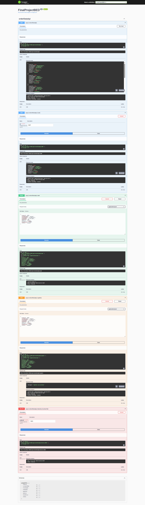
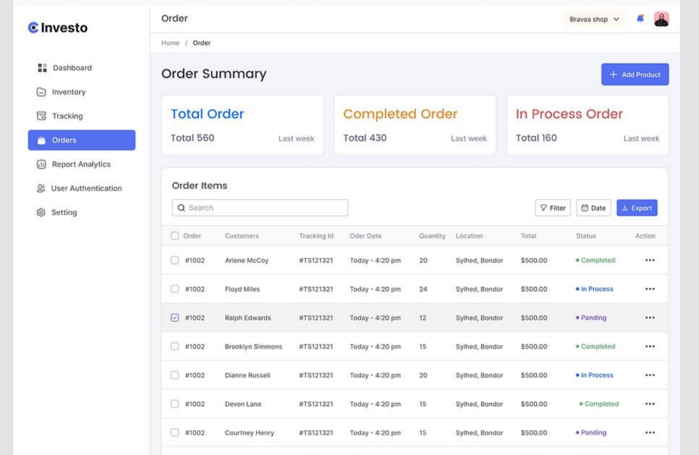
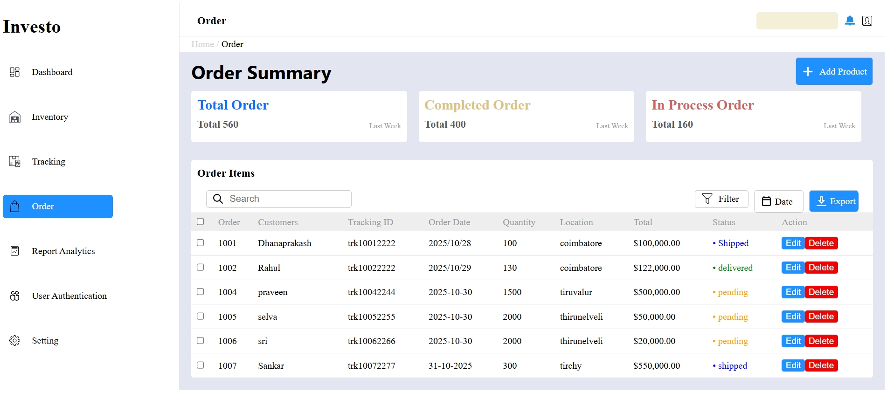
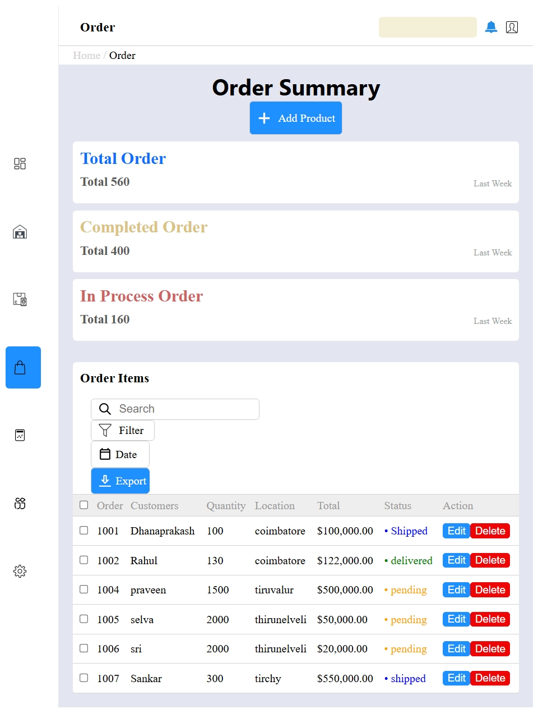
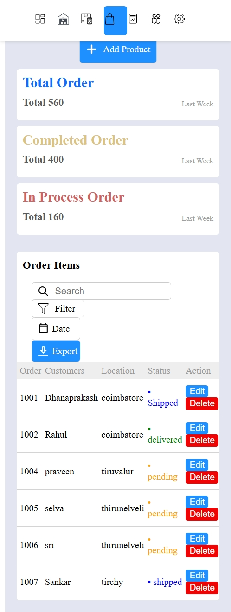

Introduction

This is the project using on Angular, C#.net & MS SQL to CRUD application.

First i started backend application using visual studio community edition 

Back-End Development:

i create model file named orderDTO used to transfer data from one layer
to another layer.

Then i connected my project to database for we need to install SQLClient
package from Nuget package mamager.

Add connection String to appsettings.json
"ConnectionStrings": {
    "DefaultConnection": "Server=localhost;Database=orderDB;Trusted_Connection=True;Encrypt=False;"
},

Write methods to get,create,update and delete data from database.

Now, controller class , it is managing RESTful endpoints using
DataAccessLayer. This controller handles CRUD operations.

Write CORS in program.cs file to access the API endpoint from frontend.

start the program the popup window will appear with url : http://localhost:5062

i added swagger to test endpoint and my application will be launched with
url : http://localhost:5062/swagger/index.html

Front-End Development:

in this project we use Angular framework for developing frontend application

To create angular project
we need node.js 
to check node is installed open command prompt type node -v
if it gives like this v22.20.0 
it means node version 22 is installed in your system

to chech angular type ng v in your command prompt
if it gives like this 

.png>)

angular cli is installed 

if any error occured
need to install angular
command prompt give this 
npm install -g @angular/cli

Create Project in Angular
ng new my-angular-app

change directory
cd my-angular-app

start appliction
ng serve -o

The -o flag automatically opens your application in your web browser, usually at http://localhost:4200/

Generate component:

change directory to src/app and give below command in terminal
ng -g -c component-name
component will created and displayed in explorer in vs code

i developed this project by following layout:

my angular output :

Responsive Design 

Tablet:

Mobile :

