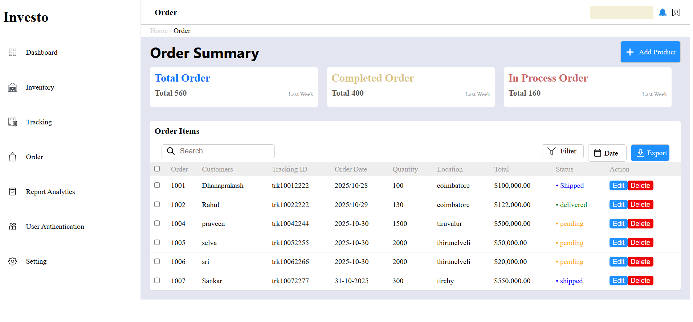

Project Overview

This project is a CRUD (Create, Read, Update, Delete) application developed using Angular, C# .NET, and MS SQL Server. It demonstrates a full-stack implementation where the backend API is built with C# and ASP.NET Core, and the frontend is developed using the Angular framework.

Back-End Development:

i. Setup and Model Creation:

The backend was developed using Visual Studio Community Edition.

A model class named orderDTO used to transfer data from one layer to another layer.

ii. Database Connection:

The application connects to SQL Server database.
Install SQLClient package from Nuget package mamager.

Add connection String to appsettings.json file:
"ConnectionStrings": {
    "DefaultConnection": "Server=localhost;Database=orderDB;Trusted_Connection=True;Encrypt=False;"
}

iii. Data Access and CRUD Operations:

CRUD methods are implemented to fetch,create,update and delete records from database.

iv. Controller Development:

Controller class is implemented to manage RESTful API endpoints.

The controller communicates with Data Access Layer to perform CRUD operations.

v. CORS Configuration:

CORS (Cross-Origin Resource Sharing) was enabled in program.cs file to allow the API request from the Angular frontend.

vi. Testing with Swagger:

Swagger was imtegrated to test API endpoint and documentation.
When the application starts, it launches Swagger UI at:

url : http://localhost:5062/swagger/index.html

Front-End Development:

i. Angular Setup:

 Angular framework is used for developing frontend application

To check node is installed open command prompt type "node -v"
Example output: v22.20.0 
it means node version 22 is installed

To check angular type "ng v" in your command prompt
Example output(below img) :

.png>)

angular cli is installed 

if any error occured
need to install angular

command prompt give this 
"npm install -g @angular/cli"

Create Project in Angular
"ng new my-angular-app"

change directory
"cd my-angular-app"

start appliction
"ng serve -o"

The -o flag automatically opens your application in your web browser, usually at http://localhost:4200/

Generate component:

change directory to src/app and give below command in terminal
"ng -g -c component-name"
component will created and displayed in explorer in vs code

ii. Application Layout:
 project layout:

Angular output :

Responsive Design:

Desktop view:

Tablet view:

Mobile view:

Result:

Backend URL: http://localhost:5062/

Swagger UI: http://localhost:5062/swagger/index.html

Frontend URL: http://localhost:4200/

This full-stack application demonstrates smooth communication between Angular and ASP.NET Core through RESTful APIs, using MS SQL Server as the database.